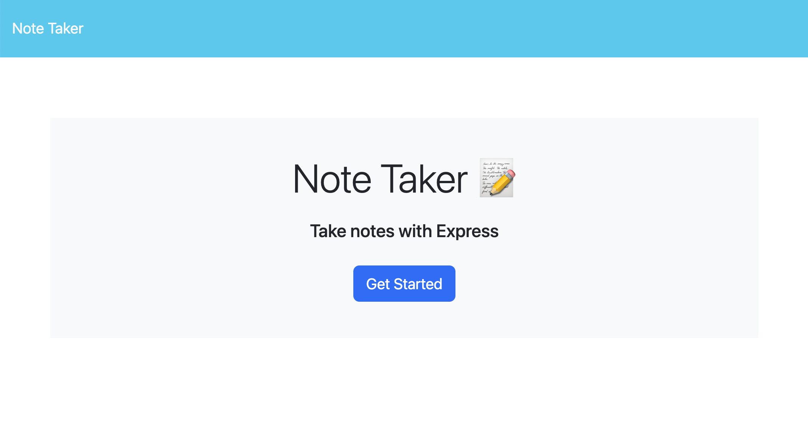
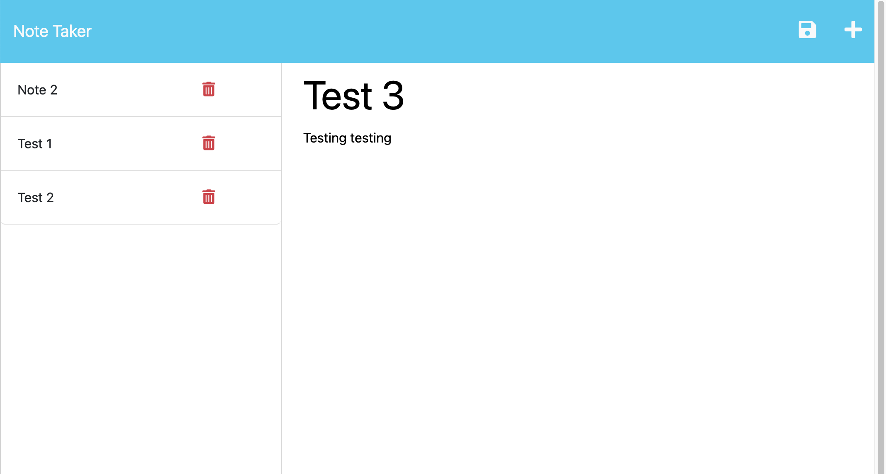

# express-note-taker
[](https://opensource.org/license/mit/)
[](https://www.contributor-covenant.org/)

## The Repository

This repository contains front end starter code and back end code made from scratch to create a full stack application to save and delete notes from a server.  This application utilizes Express.js back end and interacts with data from a JSON file. Starter code was provided by Columbia Coding Bootcamp.

---

## Installation

The code may be accessed by visiting the [GitHub repository](https://github.com/choelzli/express-note-taker) or visiting the site [URL](https://express-note-taker-ch-319295d46cd9.herokuapp.com/).

Clone the repo:
```
git clone https://github.com/choelzli/express-not-taker.git
```
---

## Usage

Upon accessing the webpage, it shows a landing page displaying a header, a title, a caption, and a, 'Get Started' button that redirects the user to a Notes page.



After clicking the button, the Notes page shows previously saved notes in the sidebar. If a saved note is clicked, it it will render to the main body of the page. If the plus symbol is clicked in the top right corner, the user is able to add a new note that can be saved once both the title and body fields have text content.


---

## License

Licensed under the MIT license.

---

## Credits

Base code strategies provided by Columbia Coding Bootcamp. Other sources include:
* [Node.js Documentation](https://nodejs.org/api/fs.html#fsreadfilepath-options-callback)